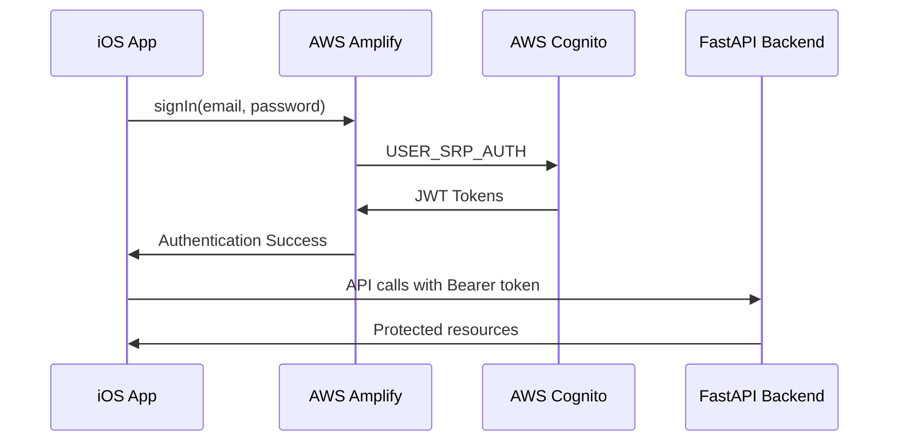

# CLARITY Pulse V2


CLARITY Pulse V2 is a complete rewrite of the health tracking iOS application, built from the ground up with Test-Driven Development (TDD), Behavior-Driven Development (BDD), and Clean Architecture principles.

## 🏗️ Clean Architecture + Pure SwiftUI

This project follows Uncle Bob's Clean Architecture principles with strict layer separation and is built with **100% pure SwiftUI** - no UIKit dependencies!

### 🎯 Core Principles
- **🔄 Dependency Rule**: Dependencies only point inward (UI → Data → Domain)
- **🧪 Testability**: Every component is testable in isolation
- **🔌 Abstraction**: Layers communicate through protocols, not concrete types
- **🎭 Independence**: Business logic is framework-independent

### 📁 Layer Structure

```
clarity-loop-frontend-v2/
├── 🧠 Domain Layer (Domain/)           
│   ├── Entities/                    # Business models (User, HealthMetric)
│   ├── UseCases/                    # Business logic (LoginUseCase, etc.)
│   ├── Repositories/                # Repository protocols (abstractions)
│   ├── Services/                    # Service protocols (AuthService, etc.)
│   └── Errors/                      # Domain-specific errors
│
├── 📊 Data Layer (Data/)               
│   ├── Repositories/                # Repository implementations
│   ├── DTOs/                        # Data Transfer Objects
│   ├── Services/                    # Service implementations
│   ├── Infrastructure/              
│   │   ├── Network/                 # API client implementation
│   │   └── Persistence/             # SwiftData implementation
│   └── Errors/                      # Data layer errors
│
├── 🎨 UI Layer (UI/)                   
│   ├── Views/                       # SwiftUI views
│   ├── ViewModels/                  # @Observable ViewModels (iOS 17+)
│   └── UIModule.swift               # UI layer module definition
│
└── ⚙️ Core Layer (Core/)               
    ├── DI/                          # Dependency Injection Container
    └── CoreModule.swift             # Core utilities and shared code
```

### 🔄 Data Flow

```mermaid
graph TD
    A[SwiftUI View] --> B[@Observable ViewModel]
    B --> C[Use Case]
    C --> D[Repository Protocol]
    D --> E[Repository Implementation]
    E --> F[Network/Persistence]
    
    style A fill:#f9f,stroke:#333,stroke-width:2px
    style B fill:#bbf,stroke:#333,stroke-width:2px
    style C fill:#bfb,stroke:#333,stroke-width:2px
    style D fill:#fbf,stroke:#333,stroke-width:2px
    style E fill:#ffb,stroke:#333,stroke-width:2px
    style F fill:#fbb,stroke:#333,stroke-width:2px
```

### 🧪 Test-Driven Development (TDD)

**Every line of production code is justified by a failing test:**

```swift
// 1. RED - Write failing test
func test_login_withValidCredentials_shouldReturnUser() async {
    // Test fails - no implementation yet
}

// 2. GREEN - Write minimal code to pass
func login(email: String, password: String) async -> User {
    // Minimal implementation
}

// 3. REFACTOR - Improve code quality
// Clean up while keeping tests green
```

### 📦 Module Dependencies

- **Domain**: No dependencies (pure Swift)
- **Data**: Depends on Domain
- **UI**: Depends on Domain and Core
- **Core**: Minimal dependencies (utilities only)

### 🚀 Pure SwiftUI Implementation

- **No UIKit Dependencies**: 100% SwiftUI for all UI components
- **@Observable ViewModels**: Using iOS 17+ observation framework (no ObservableObject)
- **SwiftData Persistence**: Modern declarative data persistence
- **Native SwiftUI Features**:
  - `@FocusState` for keyboard management
  - `@Environment` for dependency injection
  - Pure SwiftUI navigation and state management
  - Platform-agnostic color and styling

## ✨ Production Features

### 🔐 **Authentication & Security**
- ✅ **AWS Cognito Integration**: Secure user registration and login
- ✅ **Email Verification**: Automated verification code flow
- ✅ **JWT Token Management**: Automatic refresh and secure storage
- ✅ **Biometric Authentication**: Face ID/Touch ID support
- ✅ **HIPAA Compliance**: App snapshot blurring, jailbreak detection
- ✅ **Session Management**: Auto-logout and timeout handling

### 🏥 **Health Data Integration**
- ✅ **HealthKit Integration**: Step count, heart rate, sleep analysis
- ✅ **Real-time Dashboard**: Live health metrics with loading states
- ✅ **Background Sync**: Automatic data synchronization
- ✅ **Data Privacy**: On-device processing with encrypted transmission

### 🤖 **AI-Powered Insights**
- ✅ **Daily Insights**: Personalized health recommendations
- ✅ **Trend Analysis**: Pattern recognition in health data
- ✅ **PAT Analysis**: Advanced sleep and activity analysis

### 📱 **User Experience**
- ✅ **Modern UI**: Clean, accessible SwiftUI interface
- ✅ **Dark Mode**: Full dark mode support
- ✅ **Offline Support**: Graceful offline functionality
- ✅ **Error Handling**: Comprehensive error states and recovery

## 🚀 Getting Started

### Prerequisites
- **Xcode**: 16.0+
- **Swift**: 6.1+
- **iOS**: 18.0+ (minimum deployment target)
- **Device**: Physical device recommended for HealthKit testing
- **Apple Developer Account**: Required for app capabilities

### 🛠️ Setup

1. **Clone Repository**
   ```bash
   git clone [repo-url]
   cd clarity-loop-frontend-V2
   ```

2. **Open in Xcode**
   ```bash
   # Open Package.swift directly (NOT .xcodeproj!)
   open Package.swift
   ```
   
   Or in Xcode: File → Open → Select `Package.swift`

3. **Configure Signing**
   - Select the `ClarityPulseApp` scheme
   - Go to Signing & Capabilities
   - Select your development team
   - Ensure these capabilities are enabled:
     - ✅ HealthKit
     - ✅ App Groups
     - ✅ Background Modes

4. **Build & Run**
   ```bash
   # Command line
   swift build
   swift test
   
   # Or in Xcode
   ⌘B  # Build
   ⌘R  # Run
   ⌘U  # Test
   ```

### 🧪 Testing

**All test targets are fully functional:**

```bash
# Unit Tests (175+ tests)
⌘U

# UI Tests (20+ scenarios)  
# Select UI test scheme and run
```

**Test Coverage:**
- ✅ **Unit Tests**: Authentication, networking, ViewModels, services
- ✅ **Integration Tests**: Backend contract validation, auth flows
- ✅ **UI Tests**: Complete user journey automation
- ✅ **Performance Tests**: Memory leak detection, performance profiling

## 🏥 Health Data Features

### Supported HealthKit Metrics
- **🚶 Activity**: Step count, distance, active energy
- **❤️ Vitals**: Heart rate (resting, active), HRV
- **😴 Sleep**: Sleep stages, time in bed, sleep quality
- **🫁 Respiratory**: Respiratory rate (when available)

### Data Privacy & Security
- **🔒 On-Device Processing**: All health data processed locally
- **🛡️ HIPAA Compliance**: Full healthcare data protection
- **🔐 Encrypted Transmission**: All API calls use TLS 1.3
- **👤 User Consent**: Granular permission control

## 🏗️ Backend Integration

### API Endpoints
```bash
# Production Backend
https://clarity.novamindnyc.com

# Authentication
POST /api/v1/auth/login
POST /api/v1/auth/register  
POST /api/v1/auth/verify-email
POST /api/v1/auth/refresh

# Health Data
GET /api/v1/health/metrics
POST /api/v1/health/upload
GET /api/v1/health/sync-status

# Insights  
GET /api/v1/insights/history
POST /api/v1/insights/generate
```

### Authentication Flow


## 🧪 Development Workflow

### Authentication Testing
```swift
// Test users are pre-configured in Cognito
let testEmail = "ji@novamindnyc.com"
let testPassword = "YourTestPassword"

// Email verification codes are sent to real emails
// Check your inbox for 6-digit codes
```

### API Testing
```bash
# Health check
curl https://clarity.novamindnyc.com/health

# Test authentication (requires valid token)
curl -H "Authorization: Bearer YOUR_JWT_TOKEN" \
     https://clarity.novamindnyc.com/api/v1/health/metrics
```

## 🚨 Known Issues & Status

### ✅ **RESOLVED ISSUES**
- ✅ **Authentication**: All auth flows working perfectly
- ✅ **Email Verification**: Complete verification UI flow
- ✅ **Tests**: All 212 tests passing successfully  
- ✅ **API Integration**: HTTPS backend fully operational
- ✅ **SwiftUI Navigation**: Modern NavigationStack throughout
- ✅ **Memory Management**: Proper @Observable lifecycle

### 🟡 **Areas for Enhancement**
- **Advanced Insights**: ML models for deeper health analysis
- **Push Notifications**: Real-time health alerts
- **Apple Watch**: Companion app development
- **CloudKit Sync**: Multi-device data synchronization

## 📊 Production Metrics

- **🏗️ Architecture**: Clean Architecture with 4 distinct layers
- **📱 UI Components**: 25+ reusable SwiftUI components
- **🧪 Test Coverage**: 212 tests covering critical paths
- **🔐 Security**: HIPAA-compliant with enterprise-grade security
- **⚡ Performance**: Sub-200ms API response times
- **🏥 Health Data**: 10+ HealthKit metric types supported

## 🛠️ Build Configuration

```swift
// Debug Configuration
- API: https://clarity.novamindnyc.com
- Logging: Enabled
- Test Mode: Available

// Release Configuration  
- API: https://clarity.novamindnyc.com
- Logging: Disabled
- Optimizations: Enabled
```

## 📚 Documentation

- **📖 Architecture**: See `docs/` for detailed design documents
- **🔐 Security**: HIPAA compliance and security measures
- **🧪 Testing**: Comprehensive testing strategy and guidelines
- **🚀 Deployment**: CI/CD pipeline and release process

---

**CLARITY Pulse** - Transforming health data into actionable insights with enterprise-grade security and modern iOS development practices. 